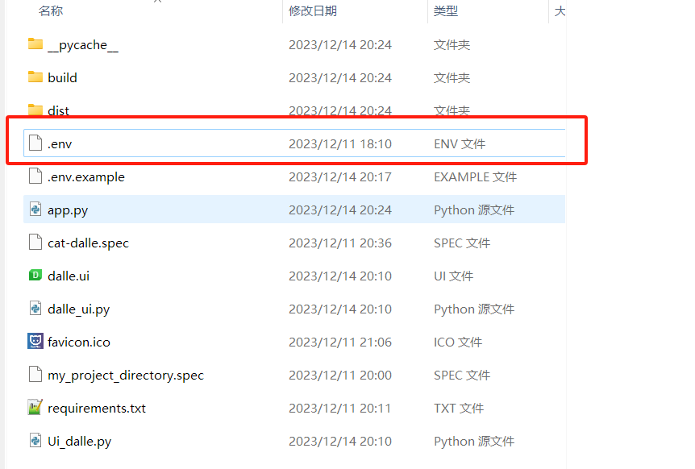
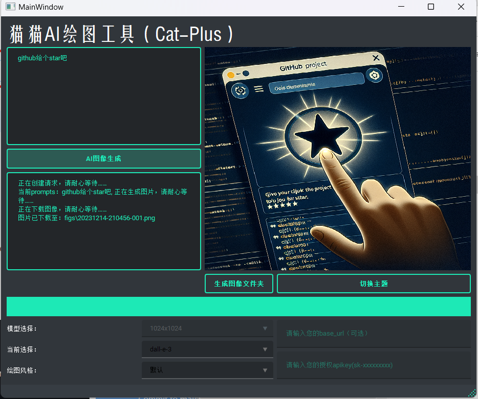
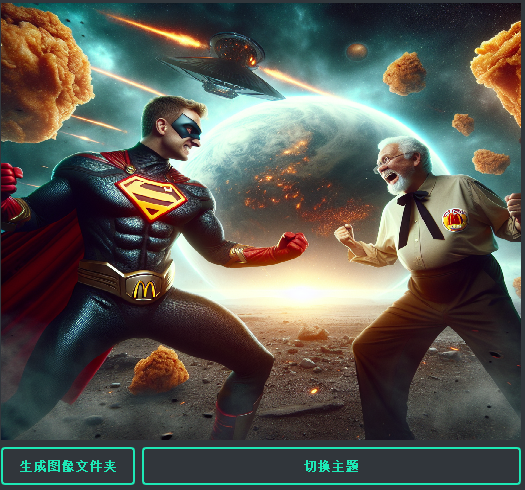

# dalle-3 Demo_pyqt
 本项目基于Openai的Dalle-3接口开发，应用界面使用pyqt5完成，支持自定义绘画风格、分辨率、base_url和apikey等参数。

## 如何使用

### Python源码
在app.py同级文件夹位置创建并修改.env

### 可执行程序
在.exe文件同级目录创建.env文件，并修改配置（与源码方式相同）

## 界面预览

## 一些彩蛋

麦当劳大战肯德基

